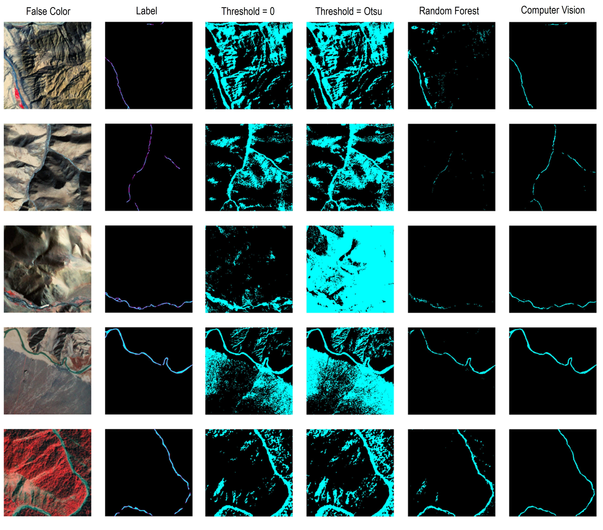
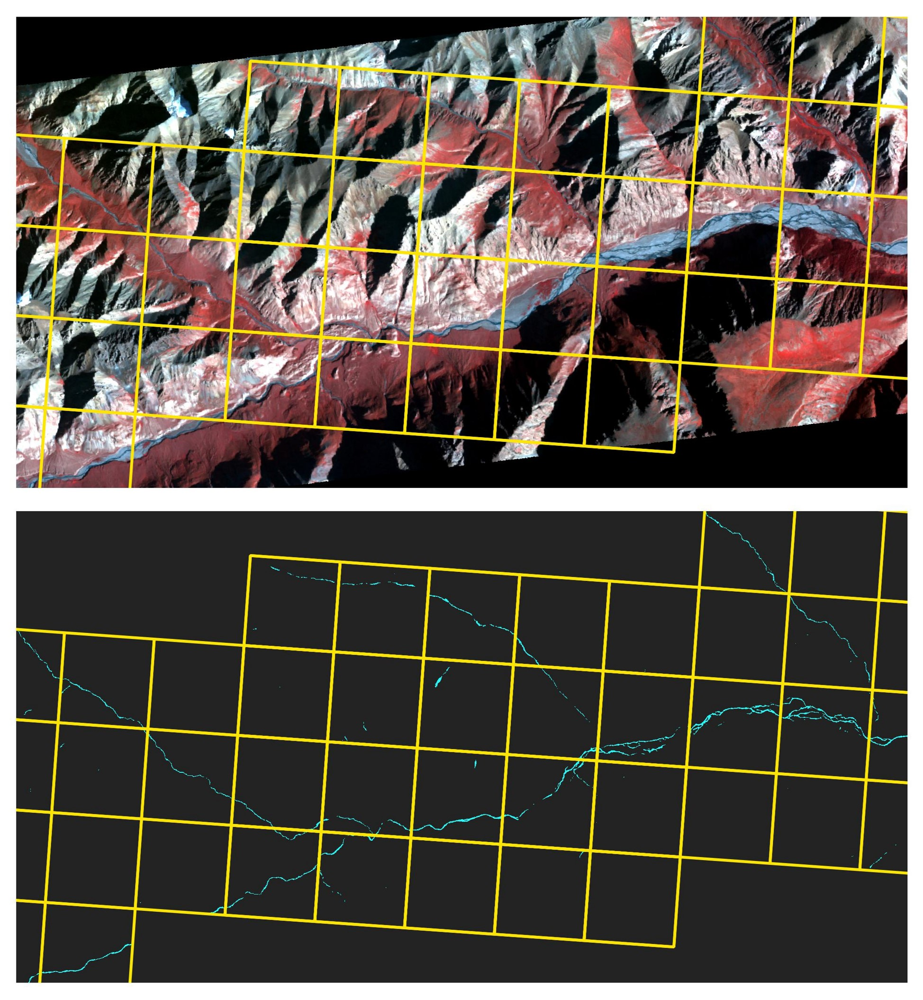

## Mapping proglacial in HMA with Planet imagery


The objective is to classify small proglacial stream in High Mountain Asia (HMA) using high-resolution Planet imagery. Raw images are preprocessed from 16-bit to 8-bit false color channels (nir,r,g,b) and are sliced into 512×512 chips before placing into the image segmentation/classification methods. Postprocessing of classified chips include merging of tiles to return the same geospatial information from the raw Planet imagery. 

### Prerequisites

Core modules:
* Tensorflow
* OpenCV
* GDAL
* Rasterio

Conda Environment:

Setup the conda environment using the *environment.yml* file. Note: This environment will include installation of core modules above and other modules might need to be updated.

```
conda env create -f environment.yml
```

### Implementation

Raw PlanetScope images should be preprocessed using *chips.py* (*/master/utils/*). 

Use the labeled chips generated from annotation tools such as [PixelAnnotationTool](https://github.com/abreheret/PixelAnnotationTool). The scripts calls the training and validation data following the structure below. Note: The *pred* folder is optional output directory for prediction tasks.

```
data
└───planet
│   └───imgs
│   │   │   chip1.tif
│   │   │   chip2.tif
│   │   │   ....
│   └───masks
│       │   chip1.png
│       │   chip2.png
│       │   ....
└───pred
    │   pred1_mask.tif
    │   pred2_mask.tif
    │   ....
```

This repo also includes PlanetAPI image lookup, order, and downloads (under */master/planetAPI/*), PlanetScope raw image preprocessing, and water classifications implementations.

```
    a) NDWI Thresholding (Simple and Otsu) - thresh.py
    b) Random forest - rf.py
    c) Computer Vision (U-Net) - cv.py
```

### Sample Results

Some illustration of mapping results between the classification methods from the PlanetScope scenes in HMA.




Illustration of multi-tile mapping within a PlanetScope strip in HMA (with computer vision).



